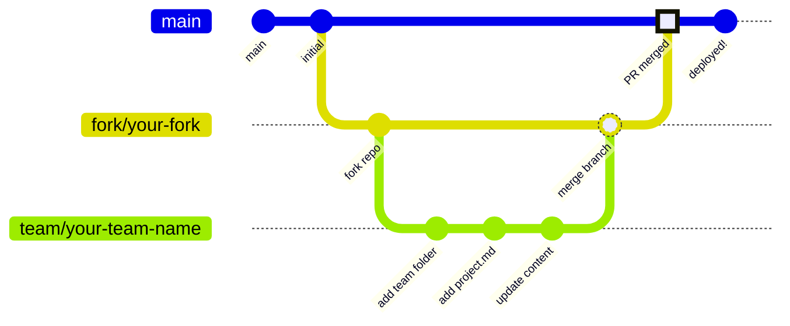

# World Bank Data Dive


## Overview

Visit www.dc2.org/datadive for details on the challenge questions, suggested data, and day of schedule!
## Team Projects

This repository includes an automated GitHub Pages deployment system for team projects. Each team can create their own folder in the `Team_Projects/` directory and add markdown files that will be automatically converted to HTML pages.

You can visit the automated site to view participants projects at [https://datacommunitydc.github.io/DataDive25/](https://datacommunitydc.github.io/DataDive25/).

### How It Works

1. **Team Setup**: Clone the `Team_Projects/SampleTeam` or create a new folder in `Team_Projects/` named after your team (e.g., `Team_Projects/MyAwesomeTeam/`)

2. **Add Content**: Update or add your markdown files (`.md`) in your team folder. The system supports multiple markdown files per team.

3. **Automatic Deployment**: When you push changes to the `main` branch, GitHub Actions will:
   - Convert all markdown files to HTML using Pandoc
   - Generate a styled HTML page for each markdown file
   - Update the main `index.html` to include links to all team projects
   - Deploy everything to GitHub Pages

### File Structure

```
Team_Projects/
├── template/           # Template folder (don't modify)
│   └── TEAM_NAME.md    # Empty template file
├── MyTeam/             # Your team folder
│   ├── project.md      # Your main project file
│   ├── analysis.md     # Additional files
│   └── results.md      # More content
└── AnotherTeam/        # Another team's folder
    └── their_work.md
```

### Markdown Features Supported

The system converts markdown to HTML with support for:
- Headers (# ## ###)
- **Bold** and *italic* text
- `inline code` and code blocks
- Links and images
- Tables
- Lists (ordered and unordered)
- Blockquotes

### Example Team Project

See `Team_Projects/SampleTeam/project.md` for an example of a complete team project submission.

### GitHub Pages URL

Once deployed, your team's pages will be available at:
`https://datacommunitydc.github.io/DataDive25/`

The main page with all team links will be at:
`https://datacommunitydc.github.io/DataDive25/index.html`

### Contributing via Forks and Pull Requests

To contribute your team's work to this repository:

1. **Fork the Repository**: Click the "Fork" button on GitHub to create your own copy of the repository
2. **Clone Your Fork**: `git clone https://github.com/YOUR-USERNAME/DataDive25.git`
3. **Create a Branch**: Create a descriptive branch for your team's work:
   ```bash
   git checkout -b team/your-team-name
   ```
4. **Make Your Changes**: Add your team folder and content in `Team_Projects/`
5. **Commit and Push**:
   ```bash
   git add .
   git commit -m "Add [YourTeamName] project"
   git push origin team/your-team-name
   ```
6. **Open a Pull Request**: Go to the original repository on GitHub and click "New Pull Request" to submit your changes for review

#### Branching Workflow Diagram



### Getting Started

1. Clone or [Fork this repository](https://github.com/datacommunitydc/DataDive25/fork)
2. Copy the `Team_Projects/template/` folder to create your team folder
3. Add your markdown content
4. Commit and push your changes
5. GitHub Actions will automatically deploy your pages

### Technical Details

- Uses Pandoc for markdown-to-HTML conversion
- Includes responsive CSS styling
- Automatic link generation in the main index
- Supports multiple markdown files per team
- Deploys to GitHub Pages on every push to main branch
